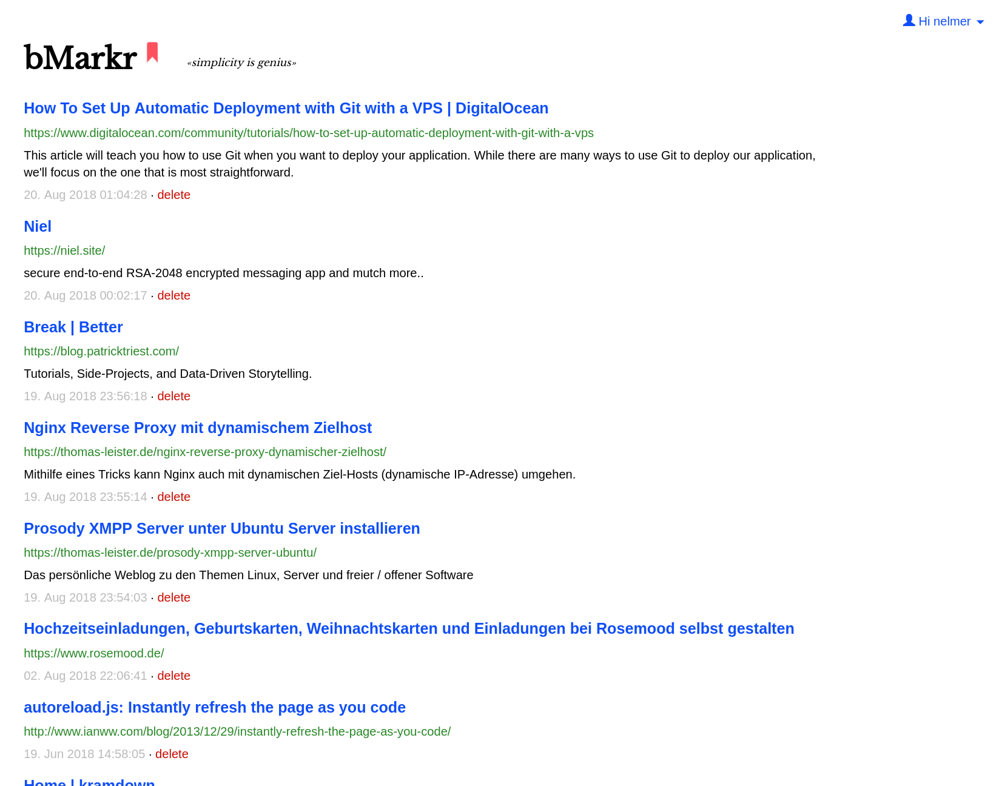
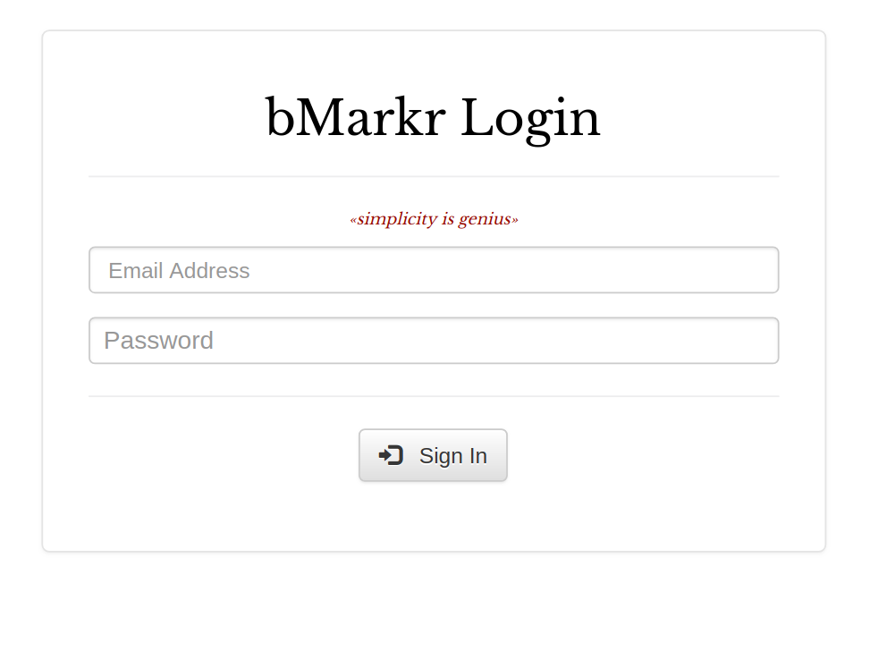

## bMarkr - a Simply php bookmarking script with bookmarklet
source: https://github.com/combatwombat/sbt - copied and modified

- Import Netscape Bookmark HTML files
- Select text before bookmarking to use as description

## Install
- Have PHP, MySQL and SSL ready
- Create database and insert the tables by importing database.sql
- Edit db_connect.php

``
/* Change scriptURL too */
$scriptURL = "Change to sth like: https://myweb.com/anything/bmark.php";    //change this
/* Database connection start */
$servername = "localhost";     
$username = "bmarkr";          //change this
$password = "";                //change this
$dbname = "bmarkr";            //change this
$conn = mysqli_connect($servername, $username, $password, $dbname) or die("Connection failed: " . mysqli_connect_error());
if (mysqli_connect_errno()) {
    printf("Connect failed: %s\n", mysqli_connect_error());
    exit();
}
``
- Upload files and folders to your server directory

Now you can point to index.php and you are ready to login with username 'test@test.com' and password 'test'. After you successfully login modify the login increditials directly in your phpmyadmin or other MySQL frontend.

Click on the red bookmark icon in order to show the menu and the bookmarklet bMarked!, just drop in your bookmarking bar of your browser and you are ready to go!

## Future tasks
- option to rate bmarks
